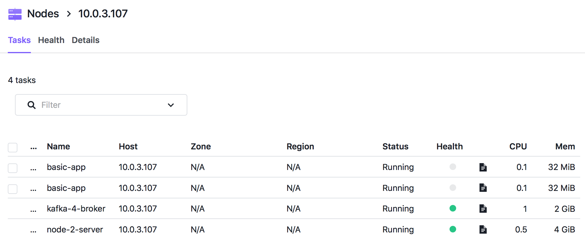
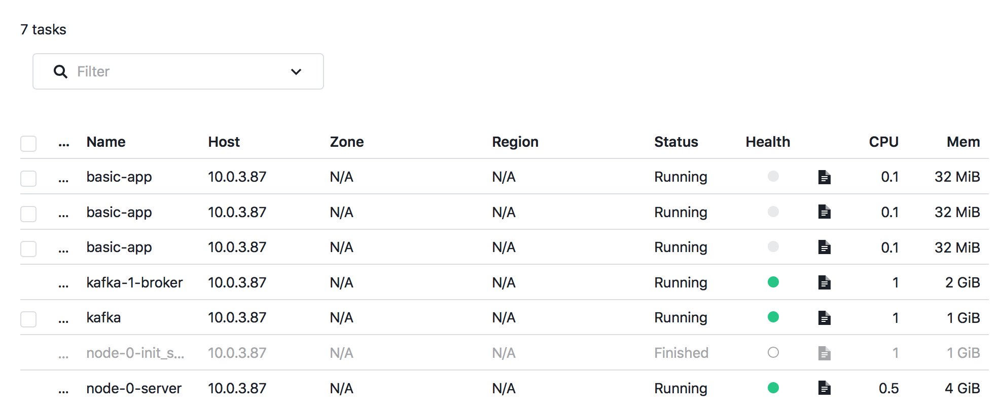

# Container-Orchestrierung
Marathon unterstützt die Provisionierung von Docker- und speziellen Mesos
Containern. Bei Mesos-Containern findet das Sandboxing in erster Linie über cgroups in Linux statt.

Innerhalb von DC/OS startet Marathon direkt neben Mesos und dient als 
Orchstrator für Applikationen und Services. Dabei werden zunächst die 
Services angestartet, da diese zusätzliche Funktionalitäten für Anwendungen in einem DC/OS-Cluster zur Verfügung stellen. 

So können bspw. innerhalb von Marathon auch gekapselte Instanzen von Webservern entweder als Docker- oder Mesos-Container ausgeführt werden.

Marathon dient auch dazu weitere Frameworks wie Chronos auf DC/OS zur Verfügung zu stellen.

## Skalierbarkeit
Über Marathon können Anwendungen über mehrere Knoten skaliert werden.
Skalierung steht hierbei nicht nur für zusätzliche Schaffung von Ressourcen
bei Engpässen, sondern auch beim Ausfall eines Knoten. Marathon übernimmt
dann die Provisionierung der durch den Ausfall betroffenen Anwendungen auf
einen anderen Knoten.

### Skalierung mit der Basic-App
Die [Basic App](container.md) soll zum Beispiel mit 10 Instanzen laufen.

Marathon hat dabei entschieden, auf welchen Knoten die Anwendung laufen soll.

### Detaillierte Betrachtung 
Für die Darstellung ist eine große Web-Anwendung herangezogen worden, die
aus einem Such-Service, Jetty für die Auslieferung statischen Contents und
Rails für dynamische Inhalte besteht.
In der ersten Abbildung ist ein DC/OS-Cluster mit sechs privaten Knoten dargestellt auf denen drei containerisierte Anwendungen laufen:

* Search-Service läuft auf einer Instanz
* Jetty auf drei Instanzen
* Rails auf fünf Instanzen

Die Anwendungen wurden dabei dynamisch auf die Knoten verteilt. 

Wenn die Anwendung nun mehr Web-Besucher bekommt, dann kann es zu Engpässen kommen und die Anwendung muss skaliert werden. Im folgenden Besipiel wurde entschieden den Such-Service und Rails zu skalieren.

Hierzu wird auf der Marathon-Oberfläche einfach nur mitgeteilt, dass die Anwendung über eine bestimmte Anzahl von Knoten skaliert werden soll. Marathon entscheidet dann aufgrund der verfügbaren Ressource (Constraints) auf welche zur Verfügung stehenden Knoten weitere Instanzen der Anwendung hochgefahren werden können.
Neben der GUI stellt Marathon auch eine REST-API zur Verfügung, sodass die Skalierung auch mittels Script möglich ist oder zeitgsteuert über [Chronos](https://github.com/mesos/chronos) vorgenommen werden kann.

Zu guter Letzt wird in der nachfolgenden Abbildung aufgezeigt, wie Marathon mit Ausfällen von Knoten vorgeht.

Fällt ein Knoten aus, so wird dies durch Marathon automatisch detektiert und die Anwendungen auf anderen Knoten provisioniert.

In AWS wurde der kurzfristige Ausfall eines Knotens durch Stoppen einer EC2-Instanz simuliert.

Kurz nach der Fehlererkennung werden die Anwendungen skaliert.

### Erkennen von Ausfällen
Um Ausfälle von Knoten und Anwendungen zu erkennen, bietet Marathon zwei Arten von Healthchecks an: [HTTP- und TCP-Ebene](http://mesosphere.github.io/marathon/docs/health-checks.html). Zusätzlich können noch Mesos-Healthchecks genutzt werden, um Ausfälle zu detektieren. Bei Ausfällen oder Meldungen zu einer als "Unhealthy" eingestuften Anwendung beginnt der Cluster nach einem vordefinierten internen Regelwerk zu skalieren. Die Skalierung funktioniert nur dann, wenn auch noch ausreichend verfügbare freie Ressourcen zur Verfügung stehen.

## Constraints
Definierte Constraints in Marathon legen fest, ob eine Anwendung oder Task eher auf Fault-Tolerance oder Node-Zugehörigkeit ausgelegt sein soll. Constraints sind im Dojo in einem einfachen Cluster zunächst nicht berücksichtigt worden.
